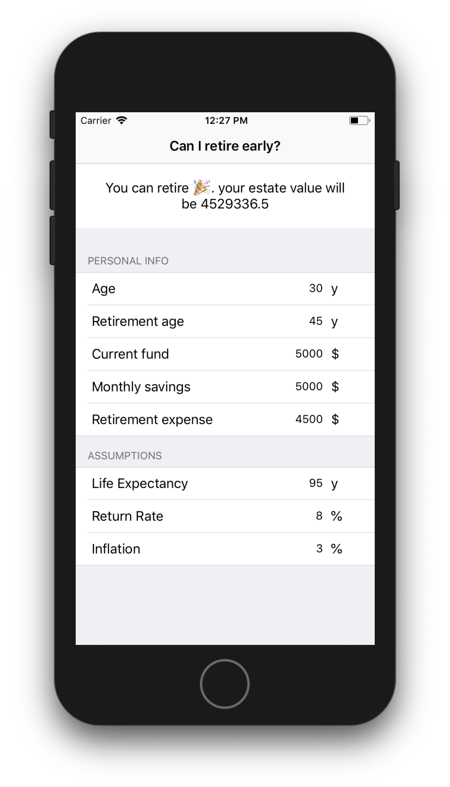

**F**inancial **I**ndependence **R**etirement **E**arly  Calculator

This is a demo app built using RxSwift and MVVM architecture. Uses a very simple mathematical model to calculate if a person can retire early and live off his savings and investments. 

### Features:

 - Uses MVVM architecture 🧠
 - Reactive viewmodels ✨
 - Two way data binding 🤝
 - Very minimal viewcontroller, we can avoid MVC(Massive View Contrllers) 😀

### TODO:

- Tests
- More tests
- Even more tests
- Save and load  particular scenario/persistance
- Asset allocation suggestion based on current age between growth and defensive assets
- Some kind of graph for yeay by year networth projection

### Links
- https://www.reddit.com/r/financialindependence/
- https://www.reddit.com/r/leanfire/
- http://cfiresim.com/